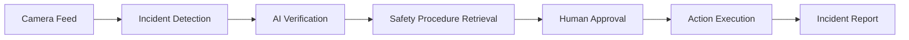

# SafetyLens

### See danger. Trigger action.

SafetyLens is an AI-powered workplace safety agent that transforms existing security cameras into proactive incident-response systems.

It continuously monitors camera feeds using lightweight computer vision. When a potential incident occurs, SafetyLens captures the relevant moment, uses multimodal AI to understand what happened, retrieves the appropriate company safety procedure, and recommends real-world actions—with human approval for critical decisions.

Built for **The Executable World: A Full-Stack AI Hackathon**.

---

## The Problem

Most workplaces already have security cameras, but these cameras are primarily passive recording devices.

When an incident occurs:

- Someone must be watching the correct camera at the correct time.
- Dangerous situations may remain unnoticed for several minutes.
- Employees must manually locate the correct safety procedure.
- Supervisors must contact the appropriate responders.
- Incident reports must be written manually.
- Footage is often reviewed only after the damage has occurred.

Running a powerful multimodal AI model continuously across every camera would also be expensive, slow, privacy-intensive, and difficult to scale.

SafetyLens bridges the gap between **seeing an incident** and **taking the correct action**.

---

## Our Solution

SafetyLens connects workplace cameras, AI reasoning, company safety procedures, and response tools into one intelligent workflow.

The system can:

- Detect a possible workplace incident
- Capture the relevant video evidence
- Determine what happened
- Evaluate severity and confidence
- Retrieve the relevant company procedure
- Recommend the correct response
- Request human approval
- Execute approved actions
- Generate a complete incident report
- Maintain an auditable history of every decision

SafetyLens transforms cameras from passive recording devices into proactive safety agents.

---

## Workflow



This event-triggered architecture keeps routine footage local and activates advanced AI only when necessary, making SafetyLens more affordable, private, and scalable.

---

## Current Stage (Stage 1)

Stage 1 delivers a polished **frontend foundation** with realistic mock data for a safety-operations command center.

### Frontend capabilities available now

- Persistent operations shell (sidebar, mobile drawer, top navigation)
- Overview dashboard with metrics, live monitor placeholder, active incident, timeline, system status, and activity feed
- Live Monitor, Incidents, Response Center, Procedures, Reports, and Settings routes
- Typed mock data for cameras, incidents, procedures, actions, services, and activity
- Mock interactions (toasts, confirmation dialogs) with no backend calls
- Dark enterprise operations visual design optimized for supervisors

### Stage 1 limitations

- No backend, database, or authentication
- No real video processing or live camera streams
- No multimodal AI integration
- No real notifications, action execution, or persistent settings
- All incidents, metrics, and procedures are mock data clearly labeled for demo use

---

## How It Works (Full Product Vision)

SafetyLens uses a two-stage AI pipeline.

### Continuous Edge Monitoring

A lightweight computer-vision model runs locally or near the camera and checks for warning signals such as worker falls, missing PPE, restricted-area entry, smoke/fire, and blocked exits.

### Advanced Incident Analysis

When a possible incident is detected, SafetyLens captures a short event clip and sends only that clip to a multimodal AI model to verify the event, assign severity/confidence, explain evidence, retrieve the procedure, and recommend actions for human approval.

---

## Demo Scenario

For the hackathon demonstration, a prerecorded workplace video will eventually simulate a live camera feed from:

**Camera 04 — Loading Zone B**

Stage 1 already presents the resulting structured incident in the UI:

```json
{
  "incident_id": "INC-2026-0042",
  "incident_type": "worker_fall",
  "location": "Loading Zone B",
  "severity": "high",
  "confidence": 0.94,
  "evidence": "The worker experienced a sudden posture change and remained on the floor.",
  "recommended_actions": [
    "Alert the floor supervisor",
    "Request medical assistance",
    "Stop nearby machinery",
    "Preserve the incident footage",
    "Create an incident report"
  ]
}
```

---

## Technology Stack

### Frontend (Stage 1 — implemented)

- Next.js (App Router)
- React
- TypeScript
- Tailwind CSS
- shadcn/ui
- Lucide React
- Recharts (reports analytics)
- Local typed mock data

### Planned backend and AI stack

- Python / FastAPI
- OpenCV and lightweight detection
- Multimodal vision-language model
- Procedure retrieval / RAG
- PostgreSQL or equivalent
- Object storage for evidence

---

## Project Structure

```text
SafetyLens/
├── frontend/                 # Next.js Stage 1 application
│   ├── src/
│   │   ├── app/              # Routes and layouts
│   │   ├── components/       # Shell + domain UI components
│   │   ├── data/             # Typed mock data
│   │   ├── lib/              # Utilities and navigation config
│   │   └── types/            # Shared TypeScript types
│   ├── .env.example
│   └── package.json
├── README.md
└── LICENSE                   # Planned
```

Backend, detection, retrieval, and sample-data directories will be added in later stages.

---

## Getting Started

### Prerequisites

- Node.js 18 or later
- npm
- Git

No API key is required to run the Stage 1 frontend.

### 1. Clone the repository

```bash
git clone https://github.com/Yug-More/SafetyLens.git
cd SafetyLens
```

### 2. Install frontend dependencies

```bash
cd frontend
npm install
```

### 3. Optional environment file

```bash
cp .env.example .env.local
```

Stage 1 does not require any values to be set. `.env` files are ignored by Git.

### 4. Run the frontend

```bash
npm run dev
```

Open:

```text
http://localhost:3000
```

### Useful commands

```bash
npm run dev      # development server
npm run build    # production build
npm run start    # serve production build
npm run lint     # ESLint
npx tsc --noEmit # TypeScript check
```

---

## Planned Future Stages

1. **Stage 2** — Video upload / simulated live feed, edge detection hooks, multimodal verification API
2. **Stage 3** — Procedure retrieval, response approval execution, notifications, incident reports
3. **Stage 4** — Multi-camera operations, auth/RBAC, persistence, production observability

---

## Why SafetyLens Is Different

Traditional camera systems answer:

> **What was recorded?**

Basic AI camera systems answer:

> **Did something unusual happen?**

SafetyLens answers:

> **What happened, how serious is it, which procedure applies, what should happen next, and were the required actions completed?**

---

## Responsible AI

SafetyLens is a decision-support system, not a replacement for emergency services or trained safety personnel.

The system is designed to:

- Display confidence and supporting evidence
- Keep consequential actions behind human approval
- Allow supervisors to modify or reject recommendations
- Record decisions for later review
- Minimize unnecessary video transmission

---

## Team

- **Yug More** — [GitHub: Yug-More](https://github.com/Yug-More)
- **Abhinav GS** — [GitHub: Abhinavgs1](https://github.com/Abhinavgs1)
- **Sean Aminov** — [GitHub: SeanAminov](https://github.com/SeanAminov)

---

## Disclaimer

This project is a hackathon prototype and should not be treated as a certified emergency-response or workplace-safety system. Critical safety decisions should always involve qualified personnel.

Stage 1 uses mock data only. It does not claim that real AI detection, video analysis, notifications, or emergency actions are operational.
