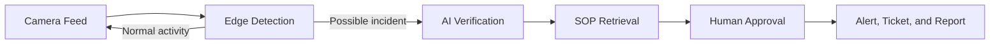
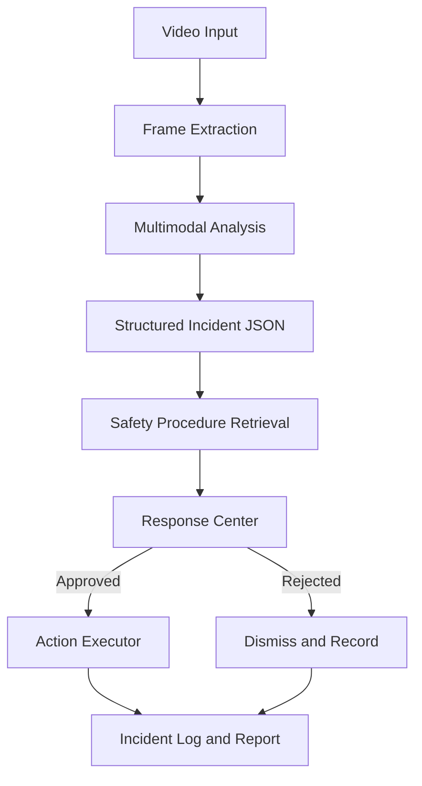

# SafetyLens

### See danger. Trigger action.

SafetyLens is an AI-powered workplace safety agent that transforms existing security cameras into proactive incident-response systems.

It continuously monitors camera feeds using lightweight computer vision. When a potential incident occurs, SafetyLens captures the relevant moment, uses multimodal AI to understand what happened, retrieves the appropriate company safety procedure, and recommends real-world actions—with human approval for critical decisions.

Built for **The Executable World: A Full-Stack AI Hackathon**.

---

## The Problem

Most workplaces already have security cameras, but these cameras are primarily passive recording devices.

When an incident occurs:

- Someone must be watching the correct camera at the correct time.
- Dangerous situations may remain unnoticed for several minutes.
- Employees must manually locate the correct safety procedure.
- Supervisors must contact the appropriate responders.
- Incident reports must be written manually.
- Footage is often reviewed only after the damage has occurred.

Running a powerful multimodal AI model continuously across every camera would also be expensive, slow, privacy-intensive, and difficult to scale.

SafetyLens bridges the gap between **seeing an incident** and **taking the correct action**.

---

## Our Solution

SafetyLens connects workplace cameras, AI reasoning, company safety procedures, and response tools into one intelligent workflow.

The system can:

- Detect a possible workplace incident
- Capture the relevant video evidence
- Determine what happened
- Evaluate severity and confidence
- Retrieve the appropriate safety procedure
- Recommend the correct response
- Request human approval
- Execute approved actions
- Generate a complete incident report
- Maintain an auditable history of every decision

SafetyLens transforms cameras from passive recording devices into proactive safety agents.

---

## How It Works

SafetyLens uses a two-stage AI pipeline.

### Stage 1: Continuous Edge Monitoring

A lightweight computer-vision model runs locally or near the camera.

It continuously checks for warning signals such as:

- A worker suddenly falling
- A person remaining motionless
- Smoke or visible fire
- Missing personal protective equipment
- Entry into a restricted area
- Unsafe proximity to machinery
- Vehicle and pedestrian near misses
- Spills or blocked pathways

Because the model is lightweight, it can operate continuously without sending all video footage to an expensive cloud AI model.

### Stage 2: Advanced Incident Analysis

When the lightweight detector identifies a possible incident, SafetyLens captures a short video segment containing the moments before and after the event.

Only this relevant event clip is sent to a multimodal AI model.

The advanced AI then:

1. Verifies whether an incident occurred
2. Identifies the incident type
3. Assigns a severity level
4. Produces a confidence score
5. Explains the supporting visual evidence
6. Retrieves the relevant company procedure
7. Recommends the appropriate response
8. Requests human approval for critical actions

---

## Workflow



This event-triggered architecture keeps routine footage local and activates advanced AI only when necessary, making SafetyLens more affordable, private, and scalable.

---

## Demo Scenario

For the hackathon demonstration, a prerecorded workplace video simulates a live camera feed from:

**Camera 04 — Loading Zone B**

The video captures a worker falling inside a warehouse.

SafetyLens detects the event and generates the following structured incident:

```json
{
  "incident_id": "INC-2026-0042",
  "incident_type": "worker_fall",
  "location": "Loading Zone B",
  "severity": "high",
  "confidence": 0.94,
  "evidence": "The worker experienced a sudden posture change and remained on the floor.",
  "recommended_actions": [
    "Alert the floor supervisor",
    "Request medical assistance",
    "Stop nearby machinery",
    "Preserve the incident footage"
  ]
}
```

SafetyLens then retrieves the relevant emergency-response procedure and displays it alongside the visual evidence.

A supervisor reviews the information and selects **Approve Actions**.

SafetyLens then:

- Alerts the floor supervisor
- Creates an incident ticket
- Preserves the relevant video segment
- Records the completed actions
- Generates a downloadable incident report
- Adds the event to the incident timeline

---

## Key Features

### Intelligent Video Monitoring

- Uploaded video or simulated live-camera feed
- Lightweight event detection
- Automatic event timestamp identification
- Relevant frame and video-clip extraction

### Multimodal Incident Analysis

- Incident classification
- Severity evaluation
- Confidence scoring
- Visual-evidence explanation
- Multi-frame verification

### Safety Procedure Retrieval

- Upload company safety documents
- Search for the relevant procedure
- Display the exact supporting passage
- Connect recommended actions to company policy

### Human-in-the-Loop Response

- Review detected evidence
- Approve, modify, or reject recommendations
- Prevent automatic execution of critical actions
- Record the supervisor’s final decision

### Action Execution

- Send a supervisor alert
- Create an incident ticket
- Preserve relevant evidence
- Display live execution status
- Generate a completed incident report

### Explainability and Auditability

- Show why the incident was detected
- Display the confidence level
- Connect actions to specific SOP passages
- Record timestamps, approvals, and completed actions
- Maintain a searchable incident history

---

## Application Screens

### 1. Live Monitor

Displays:

- Simulated or live camera feed
- Camera name and location
- Monitoring status
- Event-detection overlay
- Active incident notification

### 2. Incident Timeline

Displays:

- Incident timestamp
- Screenshot or video clip
- Incident type
- Severity
- Confidence score
- AI-generated explanation

### 3. Response Center

Displays:

- Supporting visual evidence
- Relevant safety-procedure passage
- Recommended actions
- Human approval controls
- Live execution status

### 4. Incident Report

Displays:

- Incident summary
- Location and timestamp
- Supporting evidence
- Relevant safety procedure
- Approved actions
- Completed actions
- Audit history
- Downloadable report

---

## System Architecture



---

## Technical Architecture

| Component | Responsibility |
|---|---|
| Video ingestion | Receives uploaded videos or live camera streams |
| Edge detector | Continuously identifies possible incidents |
| Event buffer | Preserves footage before and after the detected event |
| Frame extractor | Selects representative frames for AI analysis |
| Multimodal AI | Verifies and explains the incident |
| Knowledge retrieval | Finds the relevant safety-procedure passage |
| Response agent | Produces a recommended action plan |
| Approval interface | Keeps a human in control of critical actions |
| Action executor | Sends alerts and creates incident records |
| Audit layer | Stores evidence, decisions, actions, and timestamps |

---

## Technology Stack

### Frontend

- Next.js
- React
- TypeScript
- Tailwind CSS

### Backend

- Python
- FastAPI
- REST APIs or server-sent events

### Computer Vision

- OpenCV
- Lightweight object or pose detection
- Multi-frame event verification
- Optional object tracking

### AI Reasoning

- Multimodal vision-language model
- Structured incident extraction
- Severity and confidence evaluation
- Natural-language explanations

### Knowledge Retrieval

- Company safety-procedure documents
- Text embeddings
- Vector search
- Retrieval-augmented generation

### Data and Infrastructure

- PostgreSQL, sponsor database, or Supabase
- Docker
- Cloud deployment
- Object storage for incident evidence

---

## Project Structure

```text
safetylens/
├── frontend/
│   ├── app/
│   ├── components/
│   ├── public/
│   └── services/
├── backend/
│   ├── api/
│   ├── detection/
│   ├── reasoning/
│   ├── retrieval/
│   ├── actions/
│   └── reports/
├── data/
│   ├── sample-videos/
│   └── safety-procedures/
├── docs/
├── README.md
└── LICENSE
```

---

## Getting Started

### Prerequisites

Install the following tools:

- Node.js 18 or later
- Python 3.10 or later
- Git
- An API key for the selected multimodal AI provider

### 1. Clone the Repository

```bash
git clone https://github.com/Yug-More/SafetyLens.git
cd SafetyLens
```

### 2. Install Frontend Dependencies

```bash
cd frontend
npm install
```

### 3. Install Backend Dependencies

```bash
cd ../backend
python -m venv venv
source venv/bin/activate
pip install -r requirements.txt
```

On Windows:

```bash
venv\Scripts\activate
pip install -r requirements.txt
```

### 4. Configure Environment Variables

Create a `.env` file based on `.env.example`.

```env
AI_API_KEY=your_api_key
DATABASE_URL=your_database_url
VECTOR_DATABASE_URL=your_vector_database_url
```

Do not commit API keys or credentials to GitHub.

### 5. Start the Backend

```bash
cd backend
uvicorn main:app --reload
```

### 6. Start the Frontend

Open another terminal:

```bash
cd frontend
npm run dev
```

Open the application at:

```text
http://localhost:3000
```

---

## Why SafetyLens Is Different

Traditional camera systems answer:

> **What was recorded?**

Basic AI camera systems answer:

> **Did something unusual happen?**

SafetyLens answers:

> **What happened, how serious is it, which procedure applies, what should happen next, and were the required actions completed?**

SafetyLens does not stop at detection. It creates a complete and accountable incident-response workflow.

---

## Cost-Efficient Design

SafetyLens does not send every second of video to an advanced AI model.

Instead:

1. A lightweight detector monitors the video continuously.
2. The advanced model activates only when a possible incident occurs.
3. Only a short, relevant event clip is analyzed.
4. Routine footage can remain local.

For example, if a camera records 24 hours of footage but only one 20-second segment requires advanced analysis, SafetyLens avoids sending approximately **99.98% of the footage** to the expensive multimodal model.

---

## Handling Difficult Camera Conditions

Before relying on an AI prediction, SafetyLens can evaluate:

- Video resolution
- Lighting conditions
- Motion blur
- Camera angle
- Person size within the frame
- Occlusion
- Frame rate
- Detection consistency across multiple frames

If the visual evidence is weak, SafetyLens lowers its confidence and requests human review rather than presenting an uncertain conclusion as fact.

---

## Responsible AI

SafetyLens is a decision-support system, not a replacement for emergency services or trained safety personnel.

The system is designed to:

- Display confidence and supporting evidence
- Keep consequential actions behind human approval
- Allow supervisors to modify or reject recommendations
- Record decisions for later review
- Minimize unnecessary video transmission
- Support configurable access and retention policies
- Avoid presenting uncertain predictions as confirmed facts

---

## Hackathon Scope

The hackathon prototype focuses on one polished end-to-end workflow:

> **Camera → Detection → Explanation → SOP → Approval → Action → Report**

The prototype uses prerecorded video to simulate a facility camera feed.

A production deployment would add:

- Direct RTSP camera connections
- Continuous edge inference
- Multi-camera monitoring
- Enterprise authentication
- Role-based permissions
- Real notification integrations
- Custom-trained safety models
- Production observability and evaluation

---

## Future Applications

SafetyLens can eventually detect and respond to:

- Worker falls
- Smoke and fire
- Missing helmets or safety vests
- Restricted-area entry
- Spills and blocked pathways
- Unsafe machinery interactions
- Forklift and pedestrian near misses
- Suspicious activity and theft
- Patient falls in hospitals
- Emergency situations on campuses

The platform can support:

- Factories
- Warehouses
- Hospitals
- Construction sites
- Universities
- Retail stores
- Logistics centers

---

## Product Vision

SafetyLens aims to become the intelligent safety layer connecting workplace cameras, company procedures, communication systems, and incident-management tools.

Every organization already has cameras, procedures, and communication tools. SafetyLens connects them when it matters most.

---

## Team

- **Yug More** — [GitHub: Yug-More](https://github.com/Yug-More)
- **Abhinav GS** — [GitHub: Abhinavgs1](https://github.com/Abhinavgs1)
- **Sean Aminov** — [GitHub: SeanAminov](https://github.com/SeanAminov)

---

## Disclaimer

This project is a hackathon prototype and should not be treated as a certified emergency-response or workplace-safety system. Critical safety decisions should always involve qualified personnel.

---

## License

This project is licensed under the [MIT License](LICENSE).
