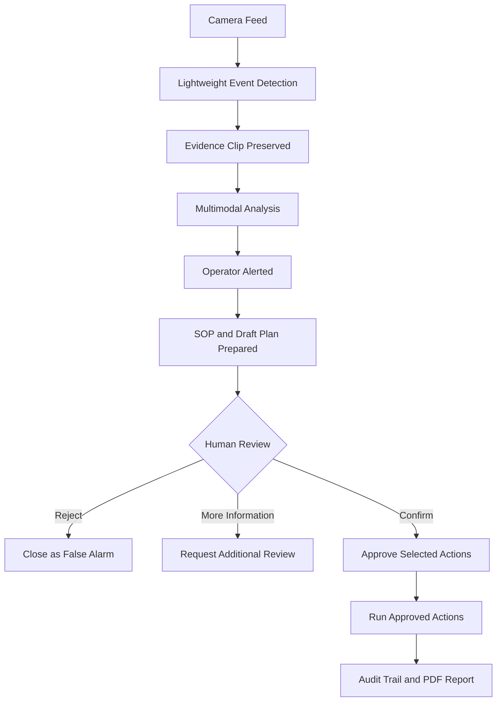
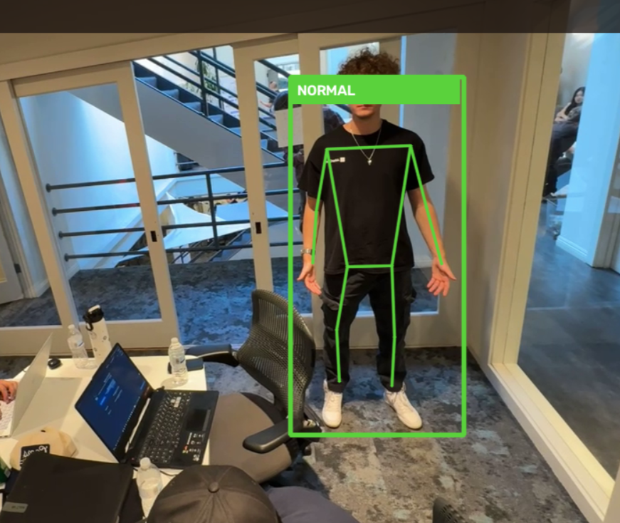
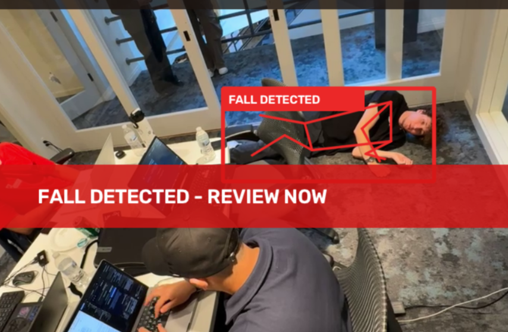
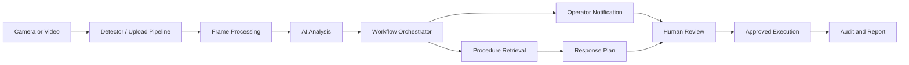

# SafetyLens

### See danger. Trigger action.

SafetyLens is an AI-powered workplace safety and incident-response platform for warehouses, factories, and other environments where teams need to notice incidents and respond quickly.

When a potential incident occurs, SafetyLens preserves the relevant evidence, analyzes what happened, alerts a safety operator, retrieves the appropriate company procedure, prepares a citation-backed response plan, and executes only the actions approved by a human.

> Built for **The Executable World: A Full-Stack AI Hackathon**

---

## The Problem

Most workplaces already have security cameras, but these cameras primarily record footage for review after an incident.

When an emergency occurs:

- Someone must notice the correct camera at the correct time.
- Relevant footage must be located and preserved manually.
- Employees must search for the appropriate safety procedure.
- Supervisors must coordinate the response across disconnected tools.
- Incident reports must be prepared afterward.

These delays can increase operational risk, response time, and administrative cost.

## Our Solution

SafetyLens connects camera evidence, multimodal reasoning, company procedures, human approval, and incident reporting into one continuous workflow:

**camera event → AI investigation → operator alert → human review → policy-grounded action → auditable report**

The system automates investigation and response preparation while preserving human authority over incident confirmation and consequential actions.

---

## How It Works



A lightweight detector can monitor camera feeds continuously. More expensive multimodal analysis is invoked only when a suspicious event requires deeper investigation, making the architecture more scalable than analyzing every full video stream continuously.

The local detector saves evidence clips and event JSON. Upload a clip or import its detector event into the dashboard to start the response workflow; the live preview does not automatically send incidents to the backend.

The default `demo` analysis provider returns configured rehearsal results without visually interpreting the footage. The optional `openai` provider analyzes extracted frames when credentials and a vision model are configured. Live pose detection runs locally with MediaPipe in either case.

---

## Live Sensing Capabilities

SafetyLens continuously senses body posture and movement from a live camera feed. Its temporal detector distinguishes normal activity from a sustained person-down event, giving the operator a simple green or red status while preserving the evidence around an incident.

| Normal activity | Confirmed fall |
| --- | --- |
|  |  |
| Full-body pose tracking follows the person while the detector reports **NORMAL**. | A sustained fall changes the tracked state to **FALL DETECTED** and calls for human review. |

---

## Core Features

### Intelligent Camera Monitoring

- Multi-camera workplace monitoring interface
- Camera and location management
- Uploaded-video and detector-event ingestion
- Automatic evidence preparation and frame extraction
- Event-driven analysis instead of continuous multimodal processing

### Explainable Incident Analysis

- Structured incident classification
- Severity and confidence assessment
- Evidence timestamps
- Key visual observations
- Clear uncertainty and human-review requirements
- Support for inconclusive evidence

### Immediate Operator Review

- Persistent in-application notifications
- Active-incident badge and alert banner
- Direct navigation to the correct incident
- Durable video and analysis context
- No repeated record selection

### Policy-Grounded Response Planning

- Company procedure ingestion
- Relevant SOP retrieval
- Exact citation verification
- Recommended actions connected to policy evidence
- Safe handling when company policy is insufficient

### Human Approval Controls

Operators can:

- Confirm an incident
- Reject it as a false alarm
- Request more information
- Select individual response actions
- Approve or reject recommended actions
- Add reviewer notes

No consequential action can execute without explicit human approval.

### Simulated Action Execution

The hackathon demonstration supports safely simulated actions such as:

- Alerting a floor supervisor
- Requesting medical assistance
- Preserving incident evidence
- Creating an incident ticket
- Isolating a hazardous area
- Scheduling follow-up review

Every simulated action is clearly labelled **SIMULATED**.

### Audit and Reporting

- Append-only application audit events
- Reviewer identity and timestamps
- Approval and execution history
- Automatic incident-report generation
- Downloadable PDF reports
- Evidence, policy citations, decisions, and actions in one report

---

## Verified Demo Scenario

The primary dashboard scenario is a possible person-down event assigned to the seeded Camera 03 — Warehouse Aisle. The live screenshots above show a staged demonstration in a meeting room.

1. A recorded Camera 03 event is submitted to SafetyLens.
2. The video is automatically prepared and analyzed.
3. SafetyLens identifies a possible person-down event.
4. The safety operator receives an immediate alert.
5. The Incident Command Center opens the correct video and evidence.
6. The relevant person-down procedure is prepared.
7. The operator confirms or rejects the incident.
8. Selected actions require explicit approval.
9. Approved actions execute in simulation.
10. SafetyLens records the audit trail and generates a PDF report.

The repository also includes a PPE review workflow with camera-specific requirements, configured demo observations, and provider-assisted analysis. It is separate from the local fall detector and is not a continuously running PPE detection model. Fire, smoke, and restricted-zone detection remain future work.

---

## System Architecture



### Cost-Efficient Design

SafetyLens does not require an expensive multimodal model to inspect every frame continuously.

- Lightweight detection monitors routine activity.
- A short evidence buffer preserves the relevant moment.
- Multimodal analysis runs only after an event trigger.
- Human review prevents uncertain predictions from becoming automatic actions.

---

## Technology Stack

### Frontend

- Next.js
- React
- TypeScript
- Tailwind CSS
- shadcn/ui

### Backend

- FastAPI
- Python
- SQLAlchemy
- SQLite
- Pydantic

### Video and AI

- OpenCV video processing
- Extracted evidence frames
- Configurable multimodal provider
- Deterministic Demo AI provider
- MediaPipe-based detector prototype

### Infrastructure

- Docker and Docker Compose
- REST APIs
- Server-side PDF generation
- Environment-based provider configuration

---

## Repository Structure

```text
SafetyLens/
├── backend/                 # FastAPI API, database, AI and workflows
│   ├── app/
│   │   ├── ai/              # AI provider abstraction
│   │   ├── api/             # API routes
│   │   ├── models/          # SQLAlchemy models
│   │   ├── schemas/         # Pydantic schemas
│   │   ├── services/        # Application services
│   │   └── seed/            # Demo seed data
│   └── tests/
├── detector/                # Lightweight detector prototype
├── frontend/                # Next.js operator dashboard
├── docs/                    # Team and demonstration documentation
└── docker-compose.yml
```

---

## Local Setup

### Prerequisites

- Python 3.12 recommended (the detector package requires Python 3.11+)
- Node.js 20+
- npm
- FFmpeg
- Git

### 1. Clone the Repository

```bash
git clone https://github.com/Yug-More/SafetyLens.git
cd SafetyLens
```

### 2. Start the Backend

```bash
cd backend
python3 -m venv .venv
source .venv/bin/activate
pip install -r requirements.txt
cp .env.example .env
python -m app.seed.run
uvicorn app.main:app --reload --host 127.0.0.1 --port 8000
```

Backend API:

```text
http://127.0.0.1:8000
```

Interactive API documentation:

```text
http://127.0.0.1:8000/docs
```

### 3. Start the Frontend

Open another terminal:

```bash
cd frontend
npm install
cp .env.example .env.local
npm run dev
```

Frontend:

```text
http://localhost:3000
```

### Windows PowerShell

From the repository root, start the backend:

```powershell
cd backend
py -3.12 -m venv .venv
.\.venv\Scripts\python.exe -m pip install -r requirements.txt
Copy-Item .env.example .env
.\.venv\Scripts\python.exe -m app.seed.run
.\.venv\Scripts\python.exe -m uvicorn app.main:app --reload --host 127.0.0.1 --port 8000
```

In a second terminal, from the repository root:

```powershell
cd frontend
npm install
Copy-Item .env.example .env.local
npm run dev
```

Copy the example environment files only during initial setup; preserve any existing local configuration. Open [the dashboard](http://localhost:3000/monitor) and [API documentation](http://127.0.0.1:8000/docs).

### Live camera detector

The camera preview is a separate local process. Follow the [detector setup](detector/README.md#analyze-a-prerecorded-video) to install its video dependencies and download the pose model, then run from the repository root:

```powershell
$env:PYTHONPATH = "detector/src"
python -m safetylens_detector.live --source 0 --model detector/models/pose_landmarker_lite.task --mirror
```

Use the Python environment containing the detector dependencies. Camera indices vary by device; the Camo phone setup used in our demo is `--source 1`. Keep one full person and the floor visible. Press `Q` to stop. Local clips, event JSON, and decision logs are saved under the ignored `detector/events/` directory. See the [detector guide](detector/README.md) for recovery behavior and overhead-camera mode.

### Docker

From the repository root, run `docker compose up --build` to start the dashboard and API with demo providers. Runtime data is retained in the `safetylens-data` volume. Run the local camera detector separately on the host.

---

## Demo Configuration

For a reliable local demonstration, configure the backend to use safe demo providers:

```env
DEMO_MODE=true
AI_PROVIDER=demo
AI_DEMO_MODE=true
PLANNER_PROVIDER=demo
```

The Demo AI provider is deterministic and intended for rehearsing the verified person-down workflow. It must not be represented as a production visual model.

Real provider credentials should remain in local environment files and must never be committed.

---

## Running the Demo

1. Open **Live Monitor**.
2. Upload a short person-down demonstration clip.
3. Assign it to **Camera 03 — Warehouse Aisle**.
4. SafetyLens automatically prepares and analyzes the evidence.
5. Wait for the operator notification.
6. Click **Review Incident**.
7. Review the video, evidence, severity, and confidence.
8. Confirm, reject, or request more information.
9. Review the prepared SOP and cited response plan.
10. Select and approve appropriate actions.
11. Run the approved **SIMULATED** actions.
12. View the audit trail and download the PDF report.

---

## Testing

### Backend

```bash
cd backend
source .venv/bin/activate
pytest
```

### Detector

```bash
cd detector
PYTHONPATH=src python -m unittest discover -s tests -v
```

### Frontend

```bash
cd frontend
npm run lint
npx tsc --noEmit
npm run build
```

---

## Safety and Limitations

SafetyLens is a hackathon prototype and is not a replacement for trained safety personnel, emergency services, or certified life-safety equipment.

- AI results require human review.
- Confidence does not represent medical certainty.
- Pose quality is not fall probability.
- External actions are simulated in the demonstration.
- The application does not contact emergency services.
- The current audit trail is application-level, not a certified compliance ledger.
- Detection reliability depends on camera angle, resolution, lighting, occlusion, and model quality.
- Production deployment would require secure authentication, role-based access, encrypted communication, monitoring, and organization-specific validation.

---

## Future Development

- Production RTSP and ONVIF camera connections
- Multi-camera edge deployment and automatic detector-to-backend delivery
- Specialized fire, smoke, and PPE models
- Multi-site facility management
- Secure role-based access control
- Slack, Teams, SMS, and ticketing integrations
- Enterprise procedure and policy management
- Privacy controls and configurable video retention
- Production-grade audit and compliance infrastructure

---

## Team

- **Yug More** — [GitHub](https://github.com/Yug-More)
- **Abhinav GS** — [GitHub](https://github.com/Abhinavgs1)
- **Sean Aminov** — [GitHub](https://github.com/SeanAminov)

---

## Documentation

- [Backend setup and detector ingestion](backend/README.md)
- [Frontend setup](frontend/README.md)
- [Detector setup and behavior](detector/README.md)
- [Demo script](docs/DEMO_SCRIPT.md) and [manual QA](docs/demo/MANUAL_QA.md)
- [Documentation index and retained planning material](docs/README.md)
