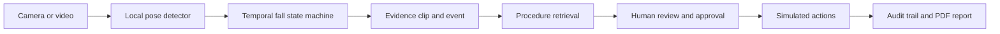

# SafetyLens

### From a possible fall to a documented, human-approved response

SafetyLens is a fall-response assistant for workplace camera footage. A lightweight local
detector watches a camera or prerecorded video for a rapid drop followed by a sustained
person-down posture. When it identifies a possible fall, SafetyLens preserves the evidence,
connects it to the relevant safety procedure, presents a proposed response for human review,
and creates an auditable incident report.

Built for **The Executable World: A Full-Stack AI Hackathon**.

> SafetyLens is a decision-support prototype, not a certified monitoring or emergency-response
> system. It flags possible falls for human review; it does not diagnose injury or contact
> emergency services.

## Demo workflow



The submission focuses on one complete scenario: **a possible worker fall**. Routine frames
remain local to the detector. Only an event and its short evidence clip enter the review
workflow.

## What works

- Live detection from a webcam or a phone exposed as a Windows camera through Camo
- Prerecorded MP4, MOV, and WebM analysis
- Explainable temporal states: monitoring, suspected, confirming, incident, and cooldown
- One event per fall episode, with short pose-loss tolerance and duplicate suppression
- Pre-event and post-event evidence buffering
- Detector-event ingestion with version validation and `event_id` deduplication
- Event-centered frame extraction and evidence review
- Retrieval of the seeded fall-response procedure with source citations
- Human approval or rejection of individual response actions
- Clearly labeled simulated execution, audit history, and downloadable PDF reports
- Local Docker Compose setup with persistent application data

## System architecture

| Component | Responsibility | Technology |
| --- | --- | --- |
| Detector | Pose estimation, motion metrics, temporal state machine, evidence buffer | Python, MediaPipe, OpenCV |
| API | Video processing, event ingestion, procedures, approvals, audit, reports | FastAPI, SQLAlchemy, SQLite |
| Web console | Evidence review and response workflow | Next.js, React, TypeScript, Tailwind CSS |

The default analysis and planning providers are deterministic local demo providers so the full
workflow runs without credentials. Their output is visibly identified as simulated. The fall
candidate itself comes from the local pose detector and state machine.

## Quick start with Docker

Requirements: Docker Desktop and Docker Compose.

```bash
git clone https://github.com/Yug-More/SafetyLens.git
cd SafetyLens
docker compose up --build
```

Open:

- Web console: http://localhost:3000
- API documentation: http://localhost:8000/docs
- Health check: http://localhost:8000/api/health

## Local development

Requirements: Python 3.11 or 3.12, Node.js 20.9+, npm, and Git.

### Backend

PowerShell:

```powershell
cd backend
py -3.12 -m venv .venv
.\.venv\Scripts\Activate.ps1
python -m pip install -r requirements.txt
Copy-Item .env.example .env
python -m app.seed.run
python -m uvicorn app.main:app --reload --host 127.0.0.1 --port 8000
```

macOS/Linux:

```bash
cd backend
python3 -m venv .venv
source .venv/bin/activate
python -m pip install -r requirements.txt
cp .env.example .env
python -m app.seed.run
python -m uvicorn app.main:app --reload --host 127.0.0.1 --port 8000
```

### Frontend

In a second terminal:

```bash
cd frontend
npm install
```

Copy `frontend/.env.example` to `frontend/.env.local`, then run:

```bash
npm run dev
```

Open http://localhost:3000.

## Run the fall detector

Install the detector and download the MediaPipe model once:

```powershell
python -m pip install -e ".\detector[video]"
New-Item -ItemType Directory -Path detector\models -Force
curl.exe -L --output detector\models\pose_landmarker_lite.task "https://storage.googleapis.com/mediapipe-models/pose_landmarker/pose_landmarker_lite/float16/latest/pose_landmarker_lite.task"
```

### Prerecorded video

From the repository root:

```powershell
$env:PYTHONPATH = "detector/src"
python -m safetylens_detector.video "C:\path\to\fall.mov" `
  --model detector/models/pose_landmarker_lite.task `
  --sample-fps 12 `
  --output detector/output/fall-result.json
```

The result contains pose coverage, state transitions, signals, and any
`possible_person_down` event. In **Live Monitor → Detector handoff**, choose the JSON and the
same source video to continue through the web workflow.

### Live phone camera with Camo on Windows

Connect the phone in Camo Studio and confirm its preview is visible. Then run:

```powershell
$env:PYTHONPATH = "detector/src"
python -m safetylens_detector.live `
  --source 1 `
  --source-id camo-phone `
  --model detector/models/pose_landmarker_lite.task `
  --sample-fps 12 `
  --mirror
```

Press `Q` in the preview window to stop. If Camo is assigned a different Windows camera
index, try `--source 0` or `--source 2`. Completed incidents save a short MP4 evidence clip
under `detector/events/`.

The live preview currently displays alerts and saves evidence locally. For the most reliable
judging path, run a consented prerecorded clip, export its detector JSON, and import the JSON
with the matching video in the web console.

## Validation

```powershell
# Backend
cd backend
.\.venv\Scripts\python.exe -m pytest -q

# Detector, from repository root
$env:PYTHONPATH = "detector/src"
.\backend\.venv\Scripts\python.exe -m unittest discover -s detector/tests

# Frontend
cd frontend
npm run lint
npm run typecheck
npm run build
```

Our small consented tuning set contains three staged falls, one walk-out-of-frame clip, and
one sitting clip. The current configuration produced one candidate for each staged fall and
none for the two negative examples at 8, 12, and 15 sampled FPS. Because the same person and
setting were used during tuning, these results are a functional demo check—not an accuracy
benchmark.

## Repository layout

```text
SafetyLens/
├── detector/        # Local pose detector, state machine, live/video runners, tests
├── backend/         # FastAPI application, database models, services, tests
├── frontend/        # Next.js operations console
├── docs/            # Demo script, QA notes, and integration documentation
└── docker-compose.yml
```

## Known boundaries

- Single-person tracking per camera
- Camera angle, occlusion, intentional floor activity, and unfamiliar environments can affect results
- Pose quality measures landmark reliability; it is not fall probability
- The bundled procedure is sample demonstration content, not legal or medical advice
- Approval records and reports are real application artifacts; external actions remain simulated
- Live Camo detection is local and does not yet automatically submit its saved clip to the dashboard

## Team

- **Yug More** — [Yug-More](https://github.com/Yug-More)
- **Abhinav GS** — [Abhinavgs1](https://github.com/Abhinavgs1)
- **Sean Aminov** — [SeanAminov](https://github.com/SeanAminov)

## Responsible use

Use only consented or appropriately licensed footage. Keep consequential decisions with a
qualified human reviewer. Do not rely on SafetyLens as the sole means of detecting or responding
to an emergency.
